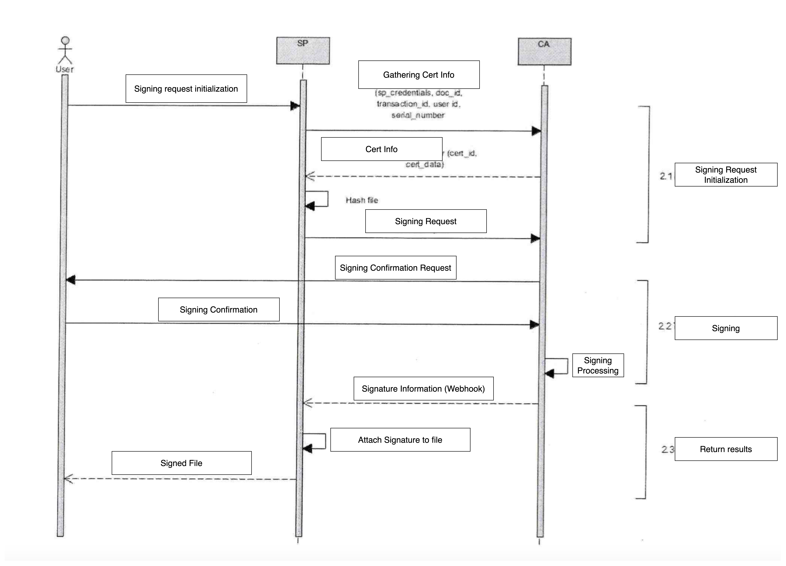

# Laverca NEAC CA Client
Simple Java client for the [NEAC CA Signature API](https://thuvienphapluat.vn/van-ban/Cong-nghe-thong-tin/Quyet-dinh-769-QD-BTTTT-2022-ket-noi-voi-to-chuc-cung-cap-chung-thuc-chu-ky-so-cong-cong-511727.aspx)



The project supports the following API end points:
- /get_certificate
- /sign

# Example Usage
List certificates
```java
NeacCaClient client = new NeacCaClient.Builder().withBaseUrl(BASE_URL)
                                                .withSpId("ABC-SP")                                              
                                                .withSpPassword("SecurePassword!")      
                                                .build();
NeacGetCertResp certs = client.getCertificate("35847001001");          
```

Sign a hash
```java
NeacCaClient client = new NeacCaClient.Builder().withBaseUrl(BASE_URL)                                           
                                                .withSpId("ABC-SP")                                              
                                                .withSpPassword("SecurePassword!")                               
                                                .build();                                                        
FileToSign      file = new FileToSign("de020bd5b1b6aa9a7a4d0af3b89ef883378cc254fae49c8c509254bbb496f2e5", "test.pdf");
NeacSignResp sigresp = client.sign("35847001001", file);                                                         
String     signature = sigresp.data.signed_files.get(0).signature_value;                                             
```
